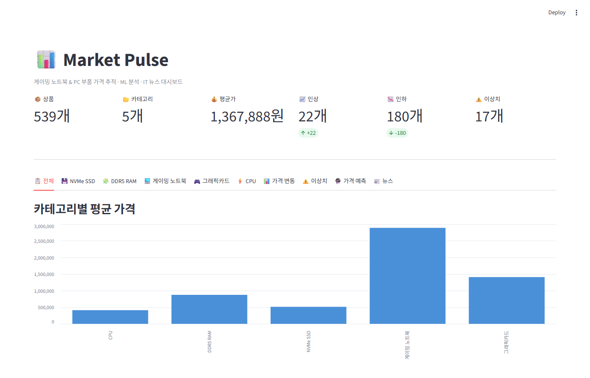
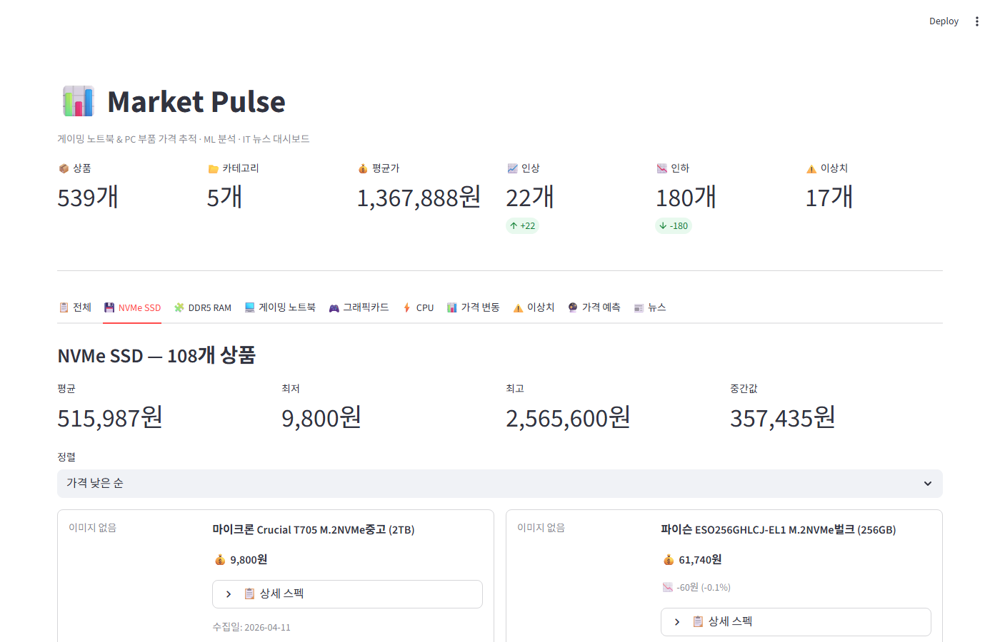
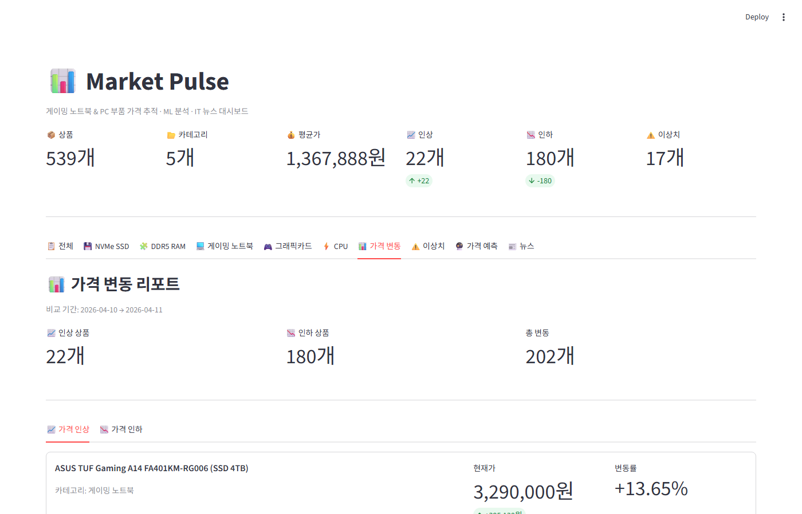
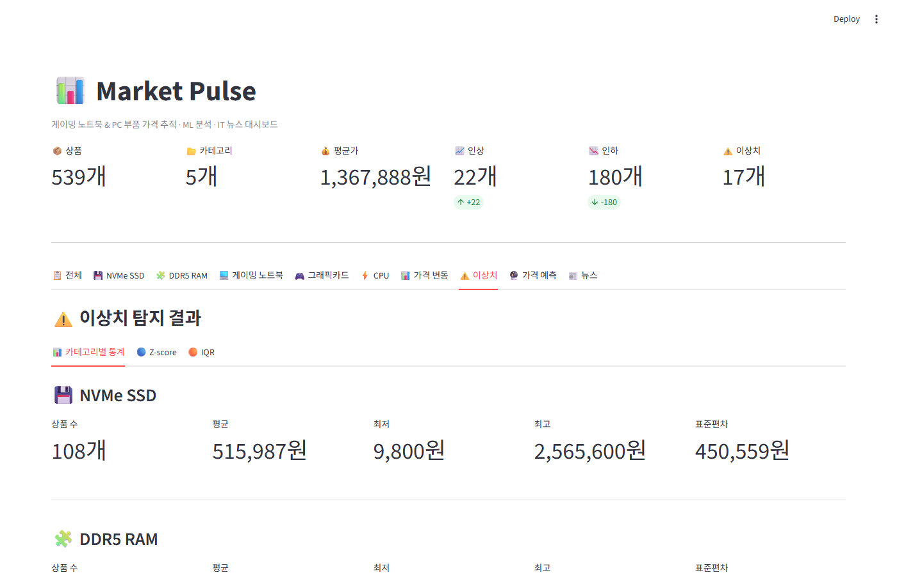
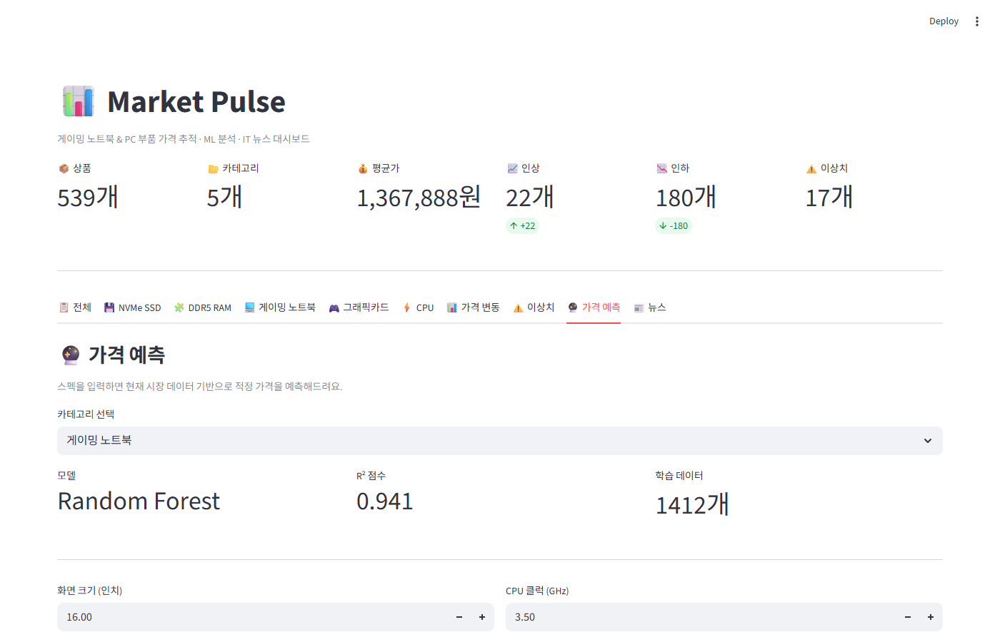
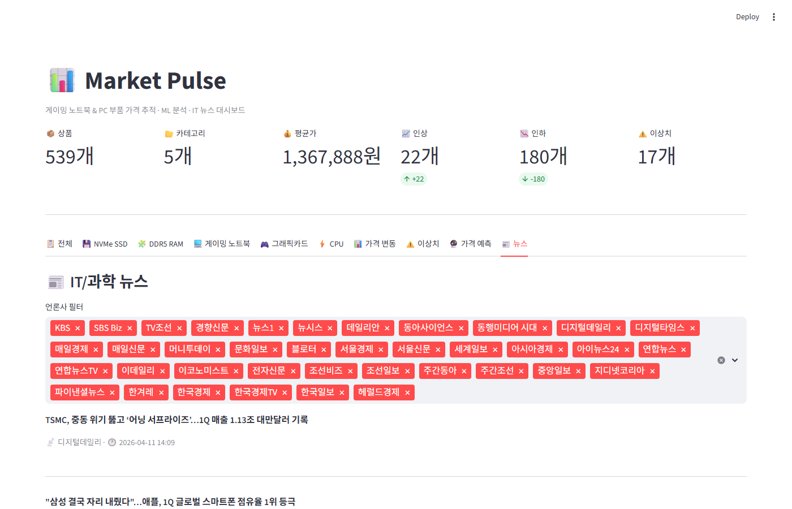

# 📊 Market Pulse

게이밍 노트북 & PC 부품 가격 자동 수집 · ML 분석 · IT 뉴스 대시보드

---

## 스크린샷

### 메인 대시보드 — 전체 요약



### 카테고리별 상품 뷰 (최신 수집일 기준)



### 가격 변동 리포트



### 이상치 탐지



### 가격 예측 (ML)



### IT/과학 뉴스



---

## 프로젝트 소개

다나와에서 게이밍 노트북, DDR5 RAM, NVMe SSD, 그래픽카드, CPU 가격을 매일 자동으로 수집하고, 네이버 IT/과학 뉴스를 모아 하나의 대시보드에서 확인할 수 있는 시스템입니다.

데이터가 쌓일수록 가격 추이 분석, 이상치 탐지, 가격 예측 정확도가 높아집니다.

## 주요 기능

| 기능 | 설명 |
|------|------|
| **가격 자동 수집** | 다나와 5개 카테고리 상품 가격·스펙·이미지 수집 |
| **뉴스 자동 수집** | 네이버 IT/과학 섹션 뉴스 제목·언론사·발행시간 수집 |
| **중복 방지** | 같은 날 같은 상품은 한 번만 저장 (`INSERT OR IGNORE`) |
| **이상치 탐지** | Z-score · IQR 두 가지 통계 방법으로 비정상 가격 감지 |
| **가격 변동 감지** | 전날 대비 인상/인하 상품 자동 리포트 |
| **가격 예측** | 스펙 기반 ML 모델로 적정 가격 예측 (Linear Regression / Random Forest) |
| **트렌드 분석** | 카테고리별 날짜별 평균가 추이 · 전체 방향 요약 |
| **대시보드** | Streamlit 웹 대시보드에서 모든 데이터를 시각적으로 확인 |

## 수집 카테고리

| 카테고리 | 수집 항목 | 출처 |
|---------|----------|------|
| 게이밍 노트북 | 가격, SSD 용량별 변형, 스펙, 이미지 | 다나와 |
| DDR5 RAM | 가격, 용량별 변형, 클럭/타이밍, 이미지 | 다나와 |
| NVMe SSD | 가격, 용량별 변형, 읽기/쓰기 속도, 이미지 | 다나와 |
| 그래픽카드 | 가격, GPU 모델, VRAM, 이미지 | 다나와 |
| CPU | 가격, 정품/벌크 변형, 코어/클럭, 이미지 | 다나와 |
| IT 뉴스 | 제목, 언론사, 발행시간 | 네이버 뉴스 |

## 기술 스택

| 역할 | 도구 |
|------|------|
| 스크래핑 | Python, requests, BeautifulSoup |
| 데이터 저장 | SQLite |
| ML 분석 | scikit-learn, pandas, numpy, scipy |
| 대시보드 | Streamlit |
| 자동화 | Windows 작업 스케줄러 + bat |

## 프로젝트 구조

```
market-pulse/
├── README.md
├── requirements.txt
├── run_scrapers.bat          # 자동 실행 배치 파일
├── scraper/
│   ├── price_scraper.py      # 다나와 가격/스펙/이미지 수집
│   └── news_scraper.py       # 네이버 뉴스 수집
├── database/
│   ├── db_manager.py         # DB 초기화 및 관리
│   └── data.db               # SQLite DB (gitignore)
├── ml/
│   ├── anomaly_detection.py  # 이상치 탐지 (Z-score, IQR)
│   ├── price_change.py       # 가격 변동 감지
│   ├── price_prediction.py   # 스펙 기반 가격 예측
│   └── trend_analysis.py     # 날짜별 가격 추이 분석
└── dashboard/
    └── app.py                # Streamlit 대시보드
```

## 설치 방법

```bash
# 레포지토리 클론
git clone https://github.com/유저명/market-pulse.git
cd market-pulse

# 라이브러리 설치
pip install -r requirements.txt
```

## 사용 방법

### 1. 데이터 수집

```bash
# DB 초기화 (최초 1회)
python database/db_manager.py

# 가격 수집
python scraper/price_scraper.py

# 뉴스 수집
python scraper/news_scraper.py

# 또는 배치 파일로 한번에
run_scrapers.bat
```

### 2. ML 분석 (단독 실행)

```bash
# 이상치 탐지
python ml/anomaly_detection.py

# 가격 변동 리포트 (2일 이상 데이터 필요)
python ml/price_change.py

# 가격 예측 모델
python ml/price_prediction.py

# 추이 분석
python ml/trend_analysis.py
```

### 3. 대시보드 실행

```bash
python -m streamlit run dashboard/app.py
```

브라우저에서 `http://localhost:8501`로 접속하면 대시보드를 볼 수 있습니다.

### 4. 자동화 (선택)

Windows 작업 스케줄러에 `run_scrapers.bat`을 등록하면 매일 자동으로 데이터를 수집합니다.

## ML 모델 설명

### 이상치 탐지

- **Z-score** — 카테고리 평균에서 표준편차 2.5배 이상 벗어난 가격을 이상치로 판단
- **IQR** — 사분위범위(Q1~Q3)의 1.5배를 벗어난 가격을 이상치로 판단
- 두 방법 모두 **최신 수집일 데이터 기준**으로 동작

### 가격 변동 감지

- 전날 같은 상품의 가격과 비교해서 인상/인하 금액과 변동률 계산
- 변동률 절대값 기준으로 TOP 정렬

### 가격 예측

- 스펙 텍스트에서 숫자 특성을 추출 (용량, 클럭, 코어 수 등)
- Linear Regression과 Random Forest를 비교해서 더 정확한 모델을 자동 선택
- 교차 검증(5-fold) R² 점수로 모델 정확도 평가

### 트렌드 분석

- 카테고리별 날짜별 평균가 추이를 계산
- 전체 기간 대비 첫날·마지막날 가격 비교로 상승/하락/유지 방향 요약
- 2일 이상 데이터 수집 시 활성화

## 요구사항

```
requests
beautifulsoup4
streamlit
pandas
numpy
scikit-learn
scipy
```

## 앞으로 할 것

- [ ] 시계열 가격 예측 (데이터 축적 후 Prophet 적용)
- [ ] 가격 알림 (특정 상품 목표가 도달 시 알림)
- [ ] 대시보드에 가격 예측 결과 반영
- [ ] 뉴스 키워드 추출 (TF-IDF)
