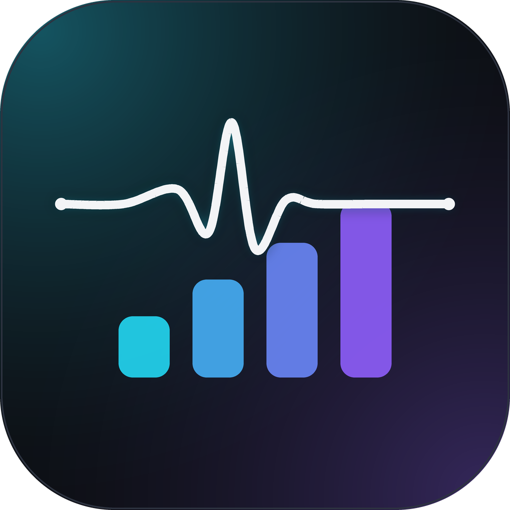
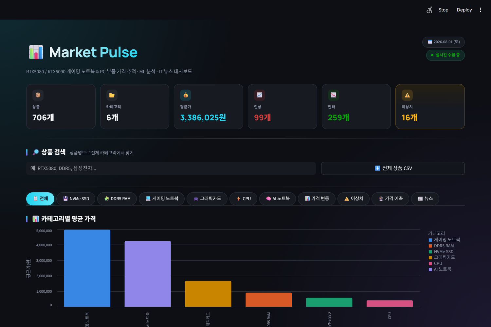
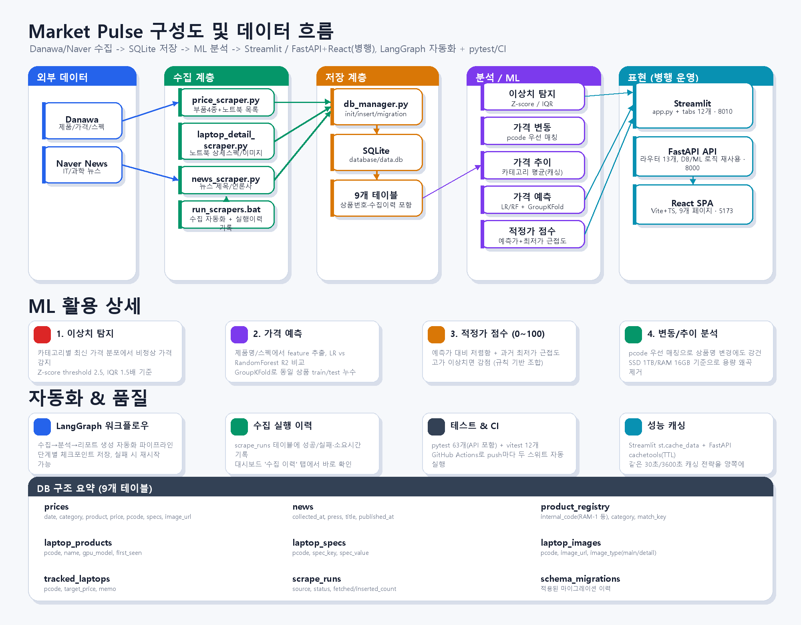

# 📊 Market Pulse

[](https://github.com/kwsahe/market-pulse/actions/workflows/tests.yml)

게이밍 노트북(RTX5080/5090) & PC 부품 가격 자동 수집 · ML 분석 · **LangGraph 기반 자동 리포트** · IT 뉴스 대시보드

대시보드는 두 가지로 제공됩니다: 기존 **Streamlit**(단일 프로세스, 빠른 실행)과 신규 **FastAPI + React**(REST API + SPA, 같은 데이터/ML 로직을 재사용하는 별도 프론트엔드) — 서로 대체 관계가 아니라 나란히 운영됩니다.

---

## 🖼️ 미리보기



다크 모드 대시보드에서 볼 수 있는 것들:
- 상품 수·평균가·가격 인상/인하·이상치 건수를 한눈에 보여주는 KPI 카드
- 카테고리별(게이밍 노트북 · AI 노트북 · DDR5 RAM · NVMe SSD · 그래픽카드 · CPU · 게이밍 모니터) 가격 추이 차트
- 상품번호(`RAM-1`, `GN-3` ...) 기반 검색 + `?code=GN-3` 형태의 상품별 공유 링크(상세정보+가격추이 단독 페이지)
- 집중 추적 상품의 목표가 도달 알림, 전체/카테고리별 CSV 내보내기
- 스펙별 가격 기여도·비슷한 제품 비교가 포함된 ML 가격 예측

### ⚡ 30초 만에 직접 보기

```bash
pip install -r requirements.txt
run_scrapers.bat                                       # 최초 1회 데이터 수집 (몇 분 소요)
streamlit run dashboard/app.py --server.port 8010      # 또는 run_data_dashboard.bat
```

→ http://localhost:8010 에서 바로 확인할 수 있습니다. React 프론트엔드로 보려면 [C. React 프론트엔드](#c-react-프론트엔드-신규)를 참고하세요.

---

## 🚀 주요 기능

| 기능 | 설명 |
|------|------|
| **자동 데이터 수집** | 다나와 7 개 카테고리(게이밍 노트북/AI 노트북/게이밍 모니터 포함) + 네이버 뉴스 매일 자동 수집 |
| **LangGraph 워크플로우** | 체크포인트, 재시도, 상태 추적 가능한 자동화 파이프라인 |
| **실시간 대시보드** | 다크 모드 UI, 상품별 공유 링크, CSV 내보내기, 목표가 알림 (Streamlit) |
| **REST API + React 프론트엔드** | FastAPI 라우터 13개(캐싱 포함) + React SPA — Streamlit과 동일한 기능을 다른 UI로 제공 |
| **이상치 탐지** | Z-score · IQR 통계 기반으로 비정상 가격 감지 |
| **가격 변동 리포트** | 전날 대비 인상/인하 상품 자동 분석 (pcode 우선 매칭으로 상품명 변경에도 강건) |
| **가격 예측 (ML)** | 스펙 기반 Linear Regression / Random Forest, GroupKFold로 데이터 누수 방지 |
| **트렌드 분석** | 카테고리별 평균가 추이 및 상승/하락 방향 |
| **자동 리포트 생성** | Markdown + HTML 형식으로 매일 자동 저장 |
| **수집 실행 이력** | 스크래퍼 성공/실패, 수집·신규 건수를 `scrape_runs` 테이블에 자동 기록 |

---

## 📦 설치 방법

```bash
# 레포지토리 클론
git clone https://github.com/your-username/market-pulse.git
cd market-pulse

# 의존성 설치
pip install -r requirements.txt
```

---

## 🎮 사용 방법

### **1. 자동 리포트 생성 (추천)**

LangGraph 워크플로우로 한 번에 실행:

```bash
# Windows
run_workflow.bat

# 또는 직접
python workflow/main.py
```

**실행 흐름:**
1. DB 초기화
2. 가격 데이터 수집 (다나와)
3. 뉴스 데이터 수집 (네이버)
4. 가격 변동 분석
5. 이상치 탐지
6. 트렌드 분석
7. 리포트 생성 (Markdown + HTML)

**결과:**
- `reports/report_YYYYMMDD_HHMMSS.md`
- `reports/report_YYYYMMDD_HHMMSS.html`
- `workflow_checkpoints/` (중간 상태 저장)

---

### **2. 대시보드 실행**

세 가지 방법으로 볼 수 있습니다:

#### **A. 데이터 분석 대시보드** (실시간 조회)
수집된 데이터를 직접 조회하고 ML 분석 결과를 시각화합니다.

```bash
# Windows
run_data_dashboard.bat

# 또는 직접
streamlit run dashboard/app.py --server.port 8010
```
- **포트**: http://localhost:8010
- **용도**: 특정 상품 가격 추이 조회, 이상치 상세 분석, ML 예측 결과 확인
- **전제 조건**: `run_scrapers.bat` 로 데이터를 먼저 수집해야 함

#### **B. 워크플로우 제어 대시보드** (자동화)
워크플로우 실행, 리포트 생성 및 관리를 합니다.

```bash
# Windows
run_dashboard.bat

# 또는 직접
streamlit run workflow_dashboard/app.py --server.port 8020
```
- **포트**: http://localhost:8020
- **용도**: 자동 리포트 생성, 과거 리포트 조회, 워크플로우 상태 모니터링
- **전제 조건**: 별도 데이터 수집 불필요 (워크플로우가 자동 수행)

#### **C. React 프론트엔드 (신규)**
같은 데이터/ML 로직을 FastAPI REST API로 감싸고, 그 위에 React(Vite+TypeScript) SPA를 새로 붙였습니다.
Streamlit 대시보드와 기능적으로 동등하며(개요/상품비교/가격예측/이상치/워치리스트/수집이력/뉴스/가격변동 +
노트북 전용 스펙 필터), 디자인을 자유롭게 다시 짤 수 있는 별도 프론트엔드가 필요할 때 씁니다.
여기에만 있는 화면으로 **3D 데스크**(`/desk`)가 있습니다 — 아래 [3D 데스크](#3d-데스크-desk) 참고.

```bash
# 1) API 서버 (포트 8000)
run_api.bat
# 또는 직접: uvicorn api.main:app --reload --port 8000

# 2) React 개발 서버 (포트 5173, 최초 1회 npm install 필요)
cd frontend
npm install
npm run dev
```
- **포트**: API http://localhost:8000 (Swagger 문서는 `/docs`), 프론트 http://localhost:5173
- **용도**: FastAPI/React 스택 자체를 보여줘야 할 때, 또는 대시보드를 커스텀 디자인으로 확장하고 싶을 때
- **전제 조건**: `run_scrapers.bat` 로 데이터를 먼저 수집해야 함 (Streamlit과 같은 `database/data.db`를 읽음)

##### 3D 데스크 (`/desk`)

가격 카테고리 7종을 실제 부품 위치로 옮겨 놓은 3D 게임룸입니다. 책상 위에는 노트북 2대와
게이밍 모니터가, 책상 옆 바닥에는 사이드 패널이 열린 데스크톱 케이스가 놓여 있습니다.
부품을 클릭하면 카메라가 그 부품 앞으로 이동하면서 오른쪽 패널에 해당 카테고리 시세가 열립니다.

| 3D 위치 | 카테고리 |
| --- | --- |
| 케이스 안 CPU 쿨러 | CPU |
| PCIe 슬롯의 그래픽카드 | 그래픽카드 |
| CPU 오른쪽 메모리 슬롯 | DDR5 RAM |
| 그래픽카드 아래 M.2 슬롯 | NVMe SSD |
| 책상 왼쪽 노트북 | 게이밍 노트북 |
| 책상 가운데 노트북 | AI 노트북 |
| 책상 오른쪽 모니터 | 게이밍 모니터 |

- 선택 상태는 `/desk?part=cpu` 처럼 URL에 남아 공유·새로고침에 그대로 유지됩니다.
- 패널 데이터는 `GET /api/categories/{category}/pulse` 한 번으로 채웁니다
  (스냅샷 통계 + 날짜별 평균가 추이 + 최저가/변동 TOP 3).
- 3D 씬(three.js)은 `/desk`에 들어갈 때만 별도 청크로 lazy 로드되므로 다른 화면의 초기 로딩에는 영향이 없습니다.
- WebGL을 못 쓰는 환경에서도 상단 부품 칩으로 같은 데이터를 볼 수 있습니다.
- 아직 수집 전인 카테고리(칩에 `·수집 전` 표시)는 요청을 보내지 않고 안내 문구만 띄웁니다.

방 구성(`frontend/src/three/room.tsx`)은 전부 장식이라 클릭 대상이 아닙니다 — 벽/천장/걸레받이, 흡음 폼 패널,
네온 펄스 사인, 육각 RGB 패널, 벽 선반, 블라인드 창, 게이밍 체어, 러그, 코너 RGB 라이트바, 화분,
데스크매트·키보드·마우스·스피커·헤드셋 스탠드·마이크 붐암, 책상 밑 케이블, 먼지 입자.

3D를 손볼 때 지켜야 하는 규칙 3가지:

1. 벽·천장은 `planeGeometry` + 안쪽 법선. `boxGeometry`로 만들면 궤도 회전할 때 바깥면이 씬을 통째로 가립니다.
2. 장식에는 포인터 핸들러를 붙이지 않고, 큰 판때기에는 `raycast={() => null}`을 걸어 부품 클릭 판정을 방해하지 않게 합니다.
3. 광원을 늘리지 않습니다. 발광은 `emissive`로 내고, 새 그림자 광원은 추가하지 않습니다
   (광원 수가 헤드리스 렌더링 비용에 직결됩니다). 전역광을 낮출 때는 반드시 부품 클로즈업 7종을 다시 렌더해
   케이스 내부가 검게 뭉치지 않는지 확인해야 합니다 — 무드보다 부품 가독성이 우선입니다.

---

### **3. 기존 스크래퍼만 실행**

```bash
run_scrapers.bat
```
- **용도**: 데이터만 수집하고 분석/리포트는 수동으로 진행할 때
- **다음 단계**: `dashboard/app.py` 에서 데이터 조회

---

### **4. ML 분석만 실행**

```bash
# 이상치 탐지
python ml/anomaly_detection.py

# 가격 변동
python ml/price_change.py

# 가격 예측
python ml/price_prediction.py

# 트렌드 분석
python ml/trend_analysis.py
```

---

## 📊 수집 카테고리

| 카테고리 | 수집 항목 |
|---------|----------|
| 게이밍 노트북 (RTX5080/5090) | 가격, 전체 스펙, 대표/상세정보 이미지, 신제품 감지 |
| AI 노트북 (통합메모리) | 애플 실리콘 / 라이젠 AI Max+LPDDR5x 온보드만 필터링해 수집 |
| DDR5 RAM | 가격, 용량, 클럭, 타이밍 |
| NVMe SSD | 가격, 용량, 읽기/쓰기 속도 |
| 그래픽카드 | 가격, GPU 모델, VRAM |
| CPU | 가격, 코어 수, 클럭 |
| 게이밍 모니터 (120Hz+) | 가격, 해상도, 주사율, 패널 종류, 응답속도 |
| IT 뉴스 | 제목, 언론사, 발행시간 |

---

## 🧪 테스트

**백엔드**: 핵심 로직(가격 변동 pcode 매칭, ML 교차검증의 GroupKFold 그룹 분리, DB 스키마/상품번호 레지스트리,
FastAPI 라우터 13개)에 대한 pytest 스위트 86개가 있습니다. 실제 `database/data.db`는 건드리지 않고
임시 DB/합성 데이터로 동작합니다.

```bash
pip install -r requirements-dev.txt
pytest -v
```

**프론트엔드**: 순수 로직(노트북 스펙 필터 매칭, CSV 이스케이핑, 3D 부품↔카테고리 매핑)에 대한 vitest 유닛 테스트가 있습니다.

```bash
cd frontend
npm install
npm test          # 유닛 테스트
npm run build     # 타입체크 + 프로덕션 빌드 확인
```

두 스위트 모두 [.github/workflows/tests.yml](.github/workflows/tests.yml)의 GitHub Actions에서 push/PR마다 자동 실행됩니다.

---

## 🏗️ 아키텍처 다이어그램



수집(Danawa/Naver) → 저장(SQLite, 9개 테이블) → 분석(이상치·가격변동·예측·적정가 점수) → 표현(Streamlit) 흐름과,
LangGraph 자동화·수집 이력·테스트/CI·캐싱까지 한 장으로 정리했습니다. 코드가 바뀌면
`python screenshots/generate_architecture_png.py`로 다시 생성할 수 있습니다.

더 상세한 Mermaid 다이어그램(ER 다이어그램, 시퀀스 다이어그램 등)은 [screenshots/ARCHITECTURE.md](screenshots/ARCHITECTURE.md)에 있습니다.

---

## 🏗️ 프로젝트 구조

```
market-pulse/
├── .github/workflows/         # GitHub Actions (백엔드 pytest + 프론트엔드 vitest/build 자동 실행)
│   └── tests.yml
├── api/                       # FastAPI REST API (Streamlit과 나란히 운영, database/ml 로직 재사용)
│   ├── main.py                # 앱 진입점 + CORS
│   ├── deps.py                # TTL 캐시 데코레이터
│   ├── schemas.py             # Pydantic 응답/요청 모델
│   └── routers/                # 엔드포인트 13개(prices/products/prediction/compare/watchlist 등)
├── frontend/                   # React(Vite+TypeScript) SPA — api/를 소비
│   └── src/
│       ├── pages/               # 개요/3D 데스크/상세/비교/예측/이상치/워치리스트/수집이력/뉴스/가격변동
│       ├── components/          # LaptopSection(노트북 전용 필터), Carousel, ChangeCard 등
│       ├── three/               # 3D 데스크 씬 — 부품↔카테고리 매핑, 지오메트리, 카메라 이동
│       └── utils/                # CSV 내보내기, 노트북 필터 매칭 (vitest 테스트 대상)
├── workflow/                 # LangGraph 워크플로우
│   ├── state.py             # 상태 정의 (TypedDict)
│   ├── nodes.py             # 각 단계 실행 함수
│   ├── graph.py             # 워크플로우 그래프 구성
│   ├── checkpoint.py        # 체크포인트 저장/복구
│   ├── report_generator.py  # 리포트 생성 (MD/HTML, 대시보드와 동일한 다크 테마)
│   └── main.py              # 실행 진입점
├── workflow_dashboard/       # Streamlit 대시보드
│   └── app.py
├── workflow_checkpoints/     # 자동 생성: 중간 상태 저장
├── reports/                  # 자동 생성: 생성된 리포트
├── scraper/                  # 데이터 수집 스크래퍼
│   ├── price_scraper.py
│   ├── news_scraper.py
│   └── laptop_detail_scraper.py  # 노트북 상세 스펙/이미지
├── database/                 # DB 관리
│   ├── db_manager.py
│   └── data.db               # 로컬 생성 (git 추적 안 함)
├── ml/                       # 머신러닝 분석
│   ├── anomaly_detection.py
│   ├── price_change.py       # pcode 우선 매칭
│   ├── price_prediction.py   # GroupKFold, 적정가 점수
│   └── trend_analysis.py
├── dashboard/                 # 실시간 데이터 조회 대시보드
│   ├── app.py                # 데이터 로딩 + 조립만 담당 (170줄)
│   ├── tabs/                  # 탭별 렌더링 모듈 12개
│   ├── laptop_view.py
│   └── theme.py
├── tests/                    # pytest 스위트 (임시 DB/합성 데이터만 사용, api/ 라우터 테스트 포함)
├── run_workflow.bat          # 워크플로우 실행
├── run_dashboard.bat         # 대시보드 실행
├── run_scrapers.bat          # 기존 스크래퍼 실행
├── run_api.bat                # FastAPI 서버 실행 (신규)
├── requirements.txt           # + fastapi, uvicorn, cachetools
└── requirements-dev.txt      # + pytest, httpx
```

---

## 🔧 기술 스택

| 역할 | 도구 |
|------|------|
| **워크플로우** | LangGraph (StateGraph, 체크포인트) |
| **스크래핑** | requests, BeautifulSoup |
| **데이터 저장** | SQLite |
| **ML 분석** | scikit-learn, pandas, numpy, scipy |
| **대시보드** | Streamlit |
| **API** | FastAPI, cachetools(TTL 캐싱) |
| **프론트엔드** | React 19, TypeScript, Vite, react-router-dom, Recharts |
| **3D** | three.js, @react-three/fiber, @react-three/drei (3D 데스크 화면 전용, lazy 로드) |
| **자동화** | Windows 작업 스케줄러 + bat |

---

## 📈 LangGraph 워크플로우 구조

```
init_db
   ↓
collect_prices ──┐
                 ├→ (병렬 실행 가능)
collect_news ────┘
   ↓
analyze_changes
   ↓
detect_anomalies
   ↓
analyze_trends
   ↓
generate_report
   ↓
finalize
```

**특징:**
- ✅ 각 단계 후 체크포인트 자동 저장
- ✅ 에러 발생 시 해당 단계에서 재시작 가능
- ✅ 상태 추적 및 모니터링
- ✅ 향후 병렬 실행/조건 분기 확장 가능

---

## 📝 예시 리포트

```markdown
# Market Pulse 리포트

**생성일:** 2026-06-22 15:17:33
**실행 ID:** 20260622_151733
**소요시간:** 24.4 초

## 📊 요약
- **가격 데이터:** 4886 개 (신규: 550 개)
- **뉴스 데이터:** 442 개 (신규: 28 개)
- **카테고리:** 게이밍 노트북, DDR5 RAM, NVMe SSD, 그래픽카드, CPU
- **총 상품:** 4886 개

## 📈 가격 변동 (327 개)
- **인상:** 191 개
- **인하:** 136 개

### TOP 5 인상
- **삼성 990 EVO Plus M.2NVMe (4TB)** (NVMe SSD)
  746,180 원 → 1,122,400 원 (+50.42%)
...
```

---

## 🔮 향후 계획

- [ ] 워크플로우 병렬 실행 최적화
- [ ] Slack/이메일 알림 통합
- [ ] LLM 기반 뉴스 요약 및 키워드 추출
- [x] 가격 예측 모델 대시보드 연동 (React 프론트엔드에서 제공)
- [ ] 시계열 예측 (Prophet) 추가
- [ ] Docker 컨테이너화
- [ ] React 프론트엔드 배포용 설정(환경변수 기반 API URL, CORS) 정리

---

## 📄 라이선스

MIT License

---

**Made with ❤️ by Market Pulse Team**