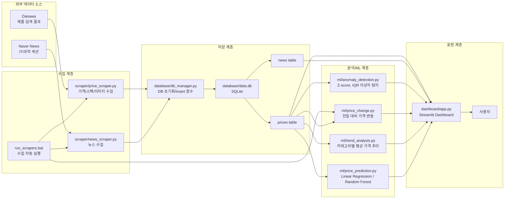
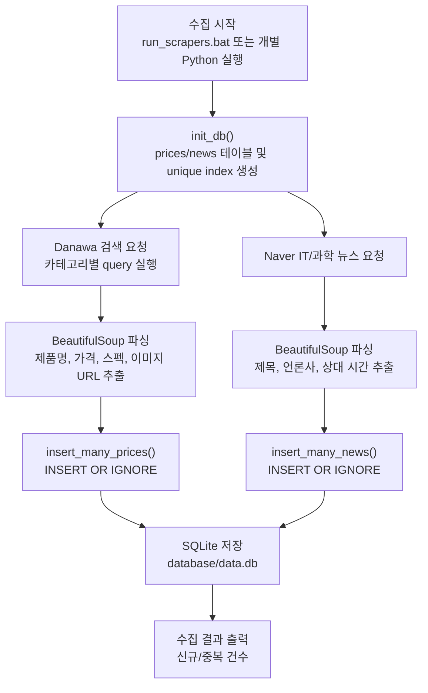
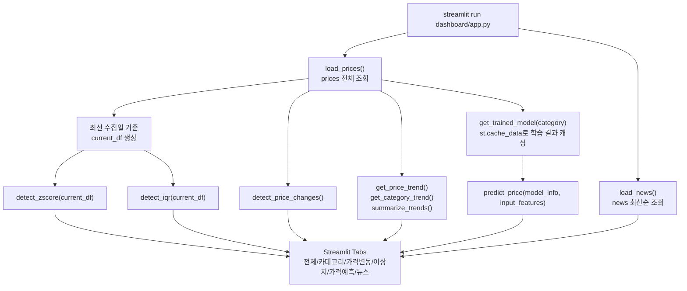
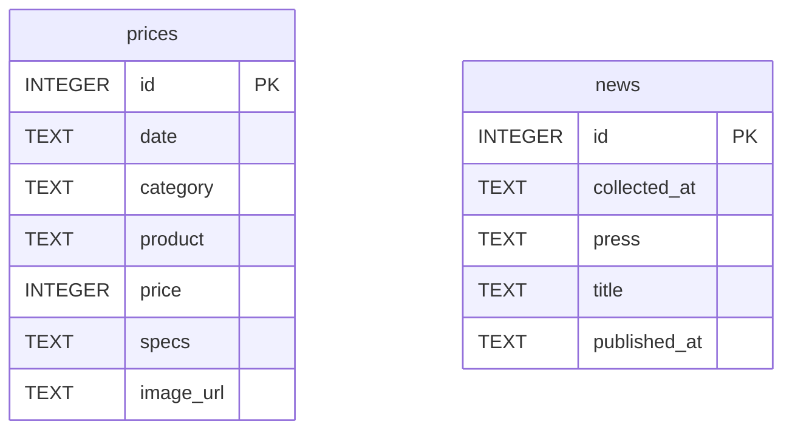
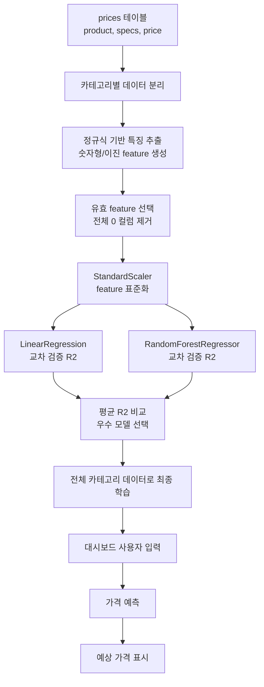
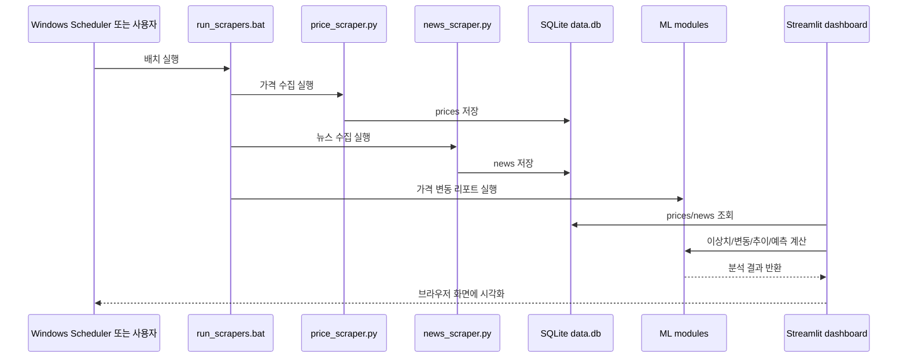

# Market Pulse 구성도 및 흐름도

## 1. 프로젝트 개요

Market Pulse는 게이밍 노트북과 PC 부품 가격을 주기적으로 수집하고, SQLite에 저장한 뒤 Streamlit 대시보드에서 가격 현황, 가격 변동, 이상치, 가격 예측, IT 뉴스를 보여주는 프로젝트입니다.

주요 데이터 소스는 다음과 같습니다.

- Danawa 검색 페이지: 제품명, 가격, 스펙, 이미지 URL 수집
- Naver IT/과학 뉴스: 언론사, 제목, 발행 시간 수집

현재 `database/data.db` 기준 데이터 규모는 다음과 같습니다.

- `prices`: 4,336건
- `news`: 341건
- 가격 카테고리: 게이밍 노트북, DDR5 RAM, NVMe SSD, 그래픽카드, CPU

## 2. 전체 구성도

## 3. 데이터 수집 흐름도

중복 저장 방지는 DB unique index와 `INSERT OR IGNORE`로 처리합니다.

- `prices`: `(date, product)` unique index
- `news`: `(title, press)` unique index

## 4. 대시보드 실행 흐름도

대시보드는 DB를 직접 읽고, ML/분석 모듈을 import하여 화면 렌더링 시점에 결과를 계산합니다. 가격 예측 모델 학습은 `@st.cache_data`로 카테고리별 캐싱됩니다.

## 5. DB 구조

두 테이블 사이에 외래키 관계는 없습니다. 대시보드에서 각각 조회해 가격 데이터와 뉴스 데이터를 별도 탭으로 표현합니다.

## 6. ML 및 분석 활용 내용

### 6.1 이상치 탐지

파일: `ml/anomaly_detection.py`

활용 방식:

- 최신 수집일의 가격 데이터를 카테고리별로 분리
- 카테고리 내부 가격 분포를 기준으로 비정상적으로 높거나 낮은 제품 탐지

사용 기법:

- Z-score
  - 가격이 카테고리 평균에서 표준편차 기준으로 얼마나 떨어져 있는지 계산
  - 기본 threshold는 `2.5`
  - `|z_score| > 2.5`이면 이상치로 판단

- IQR
  - Q1, Q3, IQR을 계산
  - `Q1 - 1.5 * IQR`보다 낮거나 `Q3 + 1.5 * IQR`보다 높으면 이상치로 판단
  - 평균/표준편차보다 극단값에 덜 민감한 방식

성격상 엄밀한 학습 모델보다는 통계 기반 이상치 탐지입니다.

### 6.2 가격 변동 탐지

파일: `ml/price_change.py`

활용 방식:

- DB에 저장된 날짜 목록 중 최신일과 직전일을 비교
- 같은 `product` 이름을 기준으로 merge
- 현재가, 이전가, 변동액, 변동률 계산
- 변동률 절댓값 기준으로 정렬

사용 기법:

- 지도학습 모델은 사용하지 않음
- 시계열 비교 및 pandas merge 기반의 규칙형 분석

### 6.3 가격 추이 분석

파일: `ml/trend_analysis.py`

활용 방식:

- 날짜와 카테고리별 평균 가격 계산
- 카테고리별 line chart 표시
- 첫 수집일과 마지막 수집일 평균 가격을 비교해 상승/하락/보합 판단

사용 기법:

- groupby 기반 집계 분석
- 변화율이 `+1%` 초과면 상승, `-1%` 미만이면 하락, 그 사이면 보합

### 6.4 가격 예측 ML

파일: `ml/price_prediction.py`

이 프로젝트에서 실제 머신러닝 모델이 사용되는 핵심 부분입니다.

활용 방식:

1. `prices` 테이블에서 특정 카테고리 데이터 조회
2. 제품명과 스펙 텍스트에서 숫자형/이진 특징 추출
3. 특징을 `StandardScaler`로 표준화
4. `LinearRegression`과 `RandomForestRegressor`를 각각 학습
5. `cross_val_score(..., scoring="r2")`로 R2 점수 비교
6. 평균 R2가 더 높은 모델을 자동 선택
7. 선택된 모델을 전체 데이터로 재학습
8. 대시보드 입력값으로 예상 가격 출력

사용 모델:

- Linear Regression
- Random Forest Regressor

평가 방식:

- 최대 5-fold 교차 검증
- 평가 지표: R2 score
- 데이터 수가 5개 미만인 카테고리는 모델 학습 생략

전처리:

- `StandardScaler`로 특징 스케일 통일
- 모든 값이 0인 특징 컬럼은 제거
- 예측 결과가 음수면 `max(0, predicted)`로 보정

카테고리별 주요 특징:

| 카테고리 | 추출 특징 |
|---|---|
| 게이밍 노트북 | 화면 크기, 무게, 밝기, CPU GHz, SSD 용량, RAM 용량 |
| DDR5 RAM | 클럭, CL 타이밍, 전압, 용량, 묶음 여부, LED/RGB 여부 |
| NVMe SSD | PCIe 세대, 읽기/쓰기 속도, DRAM 여부, TLC 여부, 용량, 외장 여부 |
| 그래픽카드 | GPU 모델, VRAM, 부스트 클럭, 카드 길이, 정격 파워 |
| CPU | 총 코어 수, 최대 클럭, 내장 그래픽 여부, 벌크 여부, 세대, 시리즈 여부 |

## 7. ML 처리 흐름도

## 8. 실행 관점 요약

## 9. 핵심 특징 및 한계

핵심 특징:

- 수집, 저장, 분석, 시각화가 단순한 Python 모듈 구조로 분리됨
- SQLite 기반이라 로컬 실행과 데모가 쉬움
- 가격 예측은 카테고리별 특징 추출 후 모델을 자동 비교 선택함
- 이상치와 가격 변동은 대시보드에서 즉시 확인 가능함

현재 한계:

- 가격 예측 모델은 제품명/스펙 텍스트의 정규식 추출 품질에 크게 의존함
- 브랜드, 판매처, 재고, 프로모션 등 가격에 영향을 주는 외부 요인은 feature에 거의 포함되지 않음
- 모델 저장 파일은 없고, 대시보드 실행 중 카테고리별로 학습/캐싱하는 구조임
- 뉴스 데이터는 가격 예측 모델 feature로 아직 연결되어 있지 않음
- 테이블 간 외래키나 정규화된 제품 마스터 테이블은 없음

