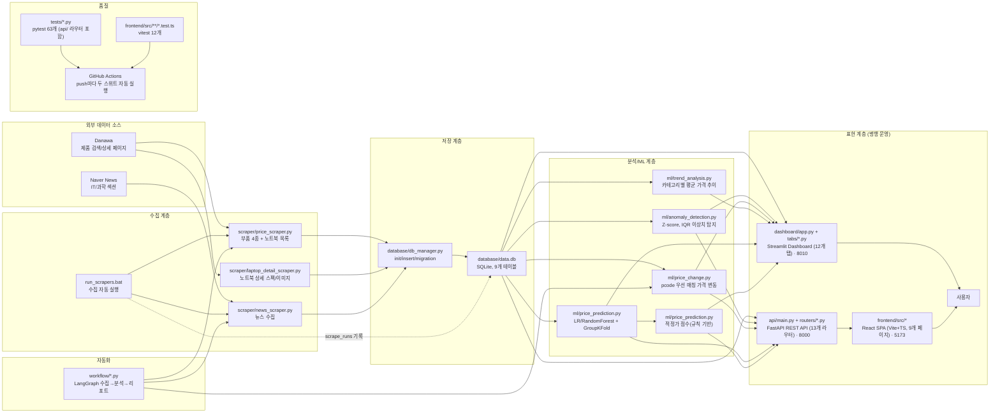
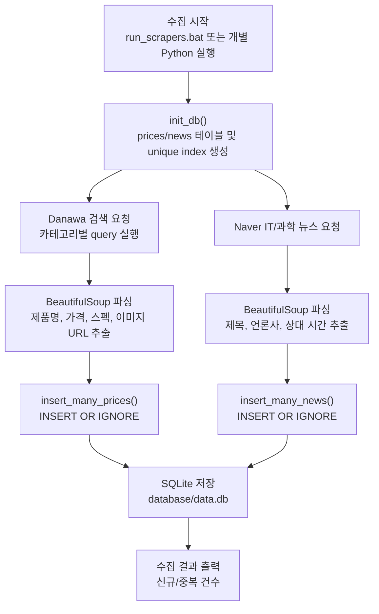
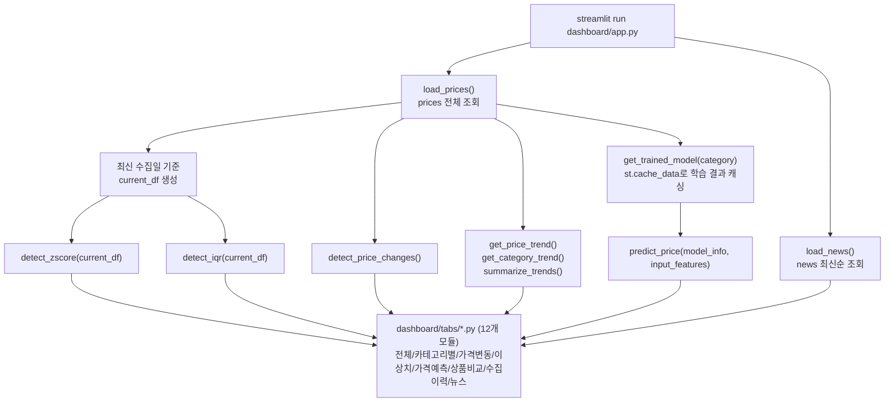
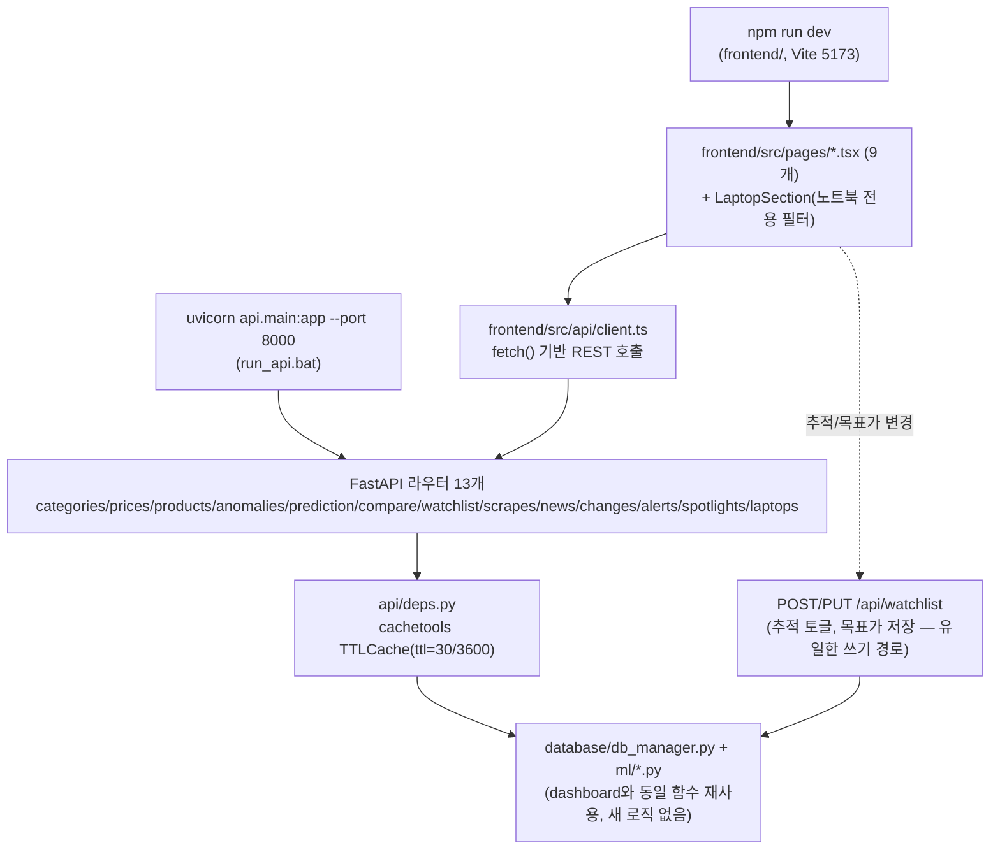
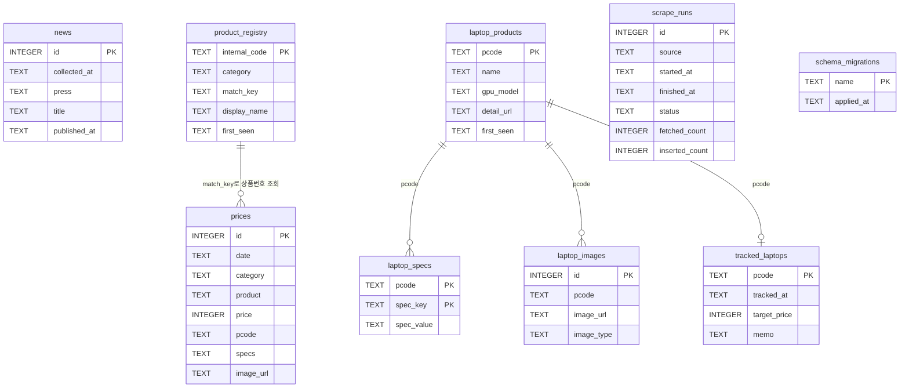
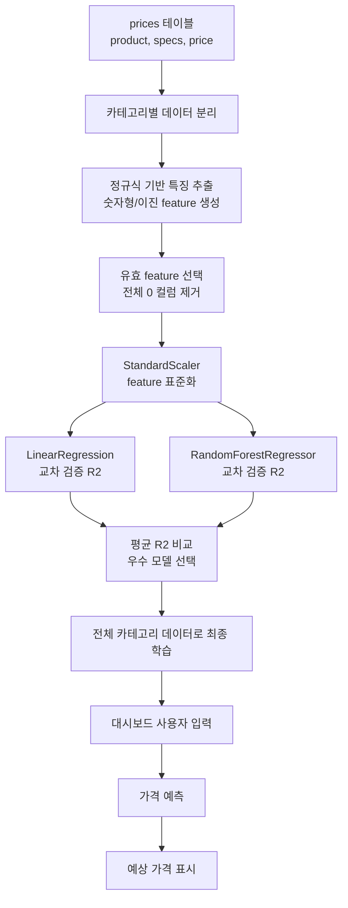
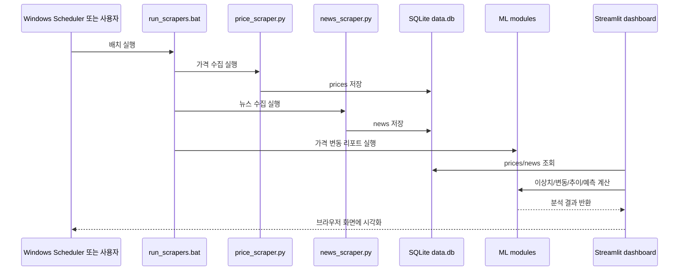

# Market Pulse 구성도 및 흐름도

## 1. 프로젝트 개요

Market Pulse는 게이밍 노트북(RTX5080/5090)·AI 노트북과 PC 부품 가격을 주기적으로 수집하고, SQLite에 저장한 뒤 대시보드에서 가격 현황, 가격 변동, 이상치, 가격 예측, 적정가 점수, 상품 비교, 수집 이력, IT 뉴스를 보여주는 프로젝트입니다. 대시보드는 두 가지로 제공됩니다: 기존 Streamlit(`dashboard/`)과, 같은 `database/db_manager.py`·`ml/*.py` 로직을 FastAPI REST API(`api/`)로 감싸고 그 위에 React(Vite+TypeScript) SPA(`frontend/`)를 새로 붙인 버전 — 서로 대체 관계가 아니라 나란히 운영됩니다. LangGraph로 수집→분석→리포트 생성을 자동화하는 워크플로우와, pytest + vitest + GitHub Actions로 백엔드/프론트엔드 핵심 로직을 검증하는 CI도 갖추고 있습니다.

주요 데이터 소스는 다음과 같습니다.

- Danawa 검색/상세 페이지: 제품명, 가격, 스펙, 이미지 URL + 노트북 상세 스펙·이미지 수집
- Naver IT/과학 뉴스: 언론사, 제목, 발행 시간 수집

현재 `database/data.db` 기준 데이터 규모는 다음과 같습니다(수집이 계속 진행 중이라 값은 계속 늘어납니다).

- `prices`: 9,600여 건
- `news`: 800여 건
- 가격 카테고리: 게이밍 노트북, AI 노트북, DDR5 RAM, NVMe SSD, 그래픽카드, CPU, 게이밍 모니터
- 테이블 수: 9개 (`prices`, `news`, `laptop_products`, `laptop_specs`, `laptop_images`, `tracked_laptops`, `product_registry`, `scrape_runs`, `schema_migrations`)

## 2. 전체 구성도

## 3. 데이터 수집 흐름도

중복 저장 방지는 DB unique index와 `INSERT OR IGNORE`로 처리합니다.

- `prices`: `(date, product)` unique index
- `news`: `(title, press)` unique index

## 4. 대시보드 실행 흐름도

`dashboard/app.py`는 데이터 로딩·전처리와 탭 조립만 담당하는 170줄짜리 진입점이고, 실제 탭 렌더링은 `dashboard/tabs/*.py`(overview/category/changes/anomalies/prediction/compare/scrapes/news 등)로 모듈 분리되어 있습니다. DB 조회(`load_prices`, `get_product_code_map` 등)와 이상치/가격변동 계산은 `dashboard/tabs/common.py`에서 `@st.cache_data`로 캐싱되는데, Streamlit은 위젯 상호작용마다 스크립트 전체(비활성 탭 포함)를 다시 실행하기 때문에 이 캐싱이 없으면 클릭 한 번마다 모든 탭의 연산이 다시 돌아 체감 지연이 커집니다. 가격 예측 모델 학습도 카테고리별로 `@st.cache_data(ttl=3600)`로 캐싱됩니다.

## 4-B. React 프론트엔드 실행 흐름도

React는 `react-router-dom`으로 9개 페이지를 라우팅하고, 데이터 페칭은 별도 라이브러리 없이 `fetch` + `useEffect` 훅(`useFetch.ts`) 하나로 처리합니다(엔드포인트 수·mutation이 적어 React Query 등은 과함). 스타일은 Tailwind 없이 `dashboard/theme.py`의 색상 토큰을 그대로 옮긴 CSS 변수(`theme.css`) + CSS Modules로 구성했습니다. FastAPI 쪽 캐싱(`api/deps.py`)은 Streamlit의 `@st.cache_data(ttl=30)`/`ttl=3600` 전략을 그대로 재현한 것이라 두 대시보드의 체감 성능 특성이 비슷합니다.

## 5. DB 구조

`prices`/`news`는 외래키 없이 SQLite `UNIQUE INDEX`로 중복만 방지합니다. 노트북류(`laptop_products`/`laptop_specs`/`laptop_images`/`tracked_laptops`)는 `pcode`(다나와 상품코드)를 공통 키로 조인합니다. `product_registry`는 부품/노트북을 가리지 않고 카테고리별 순번 상품번호(`RAM-1`, `GN-3` ...)를 부여하고, `match_key`(부품은 상품명, 노트북은 pcode)로 `prices`와 느슨하게 연결됩니다. `scrape_runs`/`schema_migrations`는 대시보드 데이터와 직접 관계는 없고, 각각 수집 실행 이력과 스키마 변경 이력을 기록합니다.

## 6. ML 및 분석 활용 내용

### 6.1 이상치 탐지

파일: `ml/anomaly_detection.py`

활용 방식:

- 최신 수집일의 가격 데이터를 카테고리별로 분리
- 카테고리 내부 가격 분포를 기준으로 비정상적으로 높거나 낮은 제품 탐지

사용 기법:

- Z-score
  - 가격이 카테고리 평균에서 표준편차 기준으로 얼마나 떨어져 있는지 계산
  - 기본 threshold는 `2.5`
  - `|z_score| > 2.5`이면 이상치로 판단

- IQR
  - Q1, Q3, IQR을 계산
  - `Q1 - 1.5 * IQR`보다 낮거나 `Q3 + 1.5 * IQR`보다 높으면 이상치로 판단
  - 평균/표준편차보다 극단값에 덜 민감한 방식

성격상 엄밀한 학습 모델보다는 통계 기반 이상치 탐지입니다.

### 6.2 가격 변동 탐지

파일: `ml/price_change.py`

활용 방식:

- DB에 저장된 날짜 목록 중 최신일과 직전일을 비교
- 같은 `product` 이름을 기준으로 merge
- 현재가, 이전가, 변동액, 변동률 계산
- 변동률 절댓값 기준으로 정렬

사용 기법:

- 지도학습 모델은 사용하지 않음
- 시계열 비교 및 pandas merge 기반의 규칙형 분석

### 6.3 가격 추이 분석

파일: `ml/trend_analysis.py`

활용 방식:

- 날짜와 카테고리별 평균 가격 계산
- 카테고리별 line chart 표시
- 첫 수집일과 마지막 수집일 평균 가격을 비교해 상승/하락/보합 판단

사용 기법:

- groupby 기반 집계 분석
- 변화율이 `+1%` 초과면 상승, `-1%` 미만이면 하락, 그 사이면 보합

### 6.4 가격 예측 ML

파일: `ml/price_prediction.py`

이 프로젝트에서 실제 머신러닝 모델이 사용되는 핵심 부분입니다.

활용 방식:

1. `prices` 테이블에서 특정 카테고리 데이터 조회
2. 제품명과 스펙 텍스트에서 숫자형/이진 특징 추출
3. 특징을 `StandardScaler`로 표준화
4. `LinearRegression`과 `RandomForestRegressor`를 각각 학습
5. `cross_val_score(..., scoring="r2")`로 R2 점수 비교
6. 평균 R2가 더 높은 모델을 자동 선택
7. 선택된 모델을 전체 데이터로 재학습
8. 대시보드 입력값으로 예상 가격 출력

사용 모델:

- Linear Regression
- Random Forest Regressor

평가 방식:

- `GroupKFold`(최대 5-fold) 교차 검증 — 같은 상품(pcode, 없으면 상품명)이 여러 수집일에 걸쳐 반복 등장하는 특성상 일반 `KFold`로 섞으면 같은 상품이 train/test에 동시에 들어가 R2가 과대평가된다. GroupKFold로 상품 단위 분리를 강제해서 이 데이터 누수를 막는다(실측: DDR5 RAM R2 0.911 → 0.598로 교정)
- 평가 지표: R2 score
- 데이터 수가 5개 미만인 카테고리는 모델 학습 생략

### 6.5 적정가 점수 (0~100점)

파일: `ml/price_prediction.py` (`compute_fair_price_score`)

회귀 모델이 아니라 규칙 기반 조합 점수입니다.

- 예측가 대비 저렴할수록 가점, 비쌀수록 감점 (1%당 1점)
- 과거 최저가~최고가 구간에서 중앙값 대비 최저가 쪽이면 가점, 최고가 쪽이면 감점 (최대 ±30점)
- 고가 이상치로 탐지되면 15점 감점
- 기준점은 50점("보통")이고, 80점 이상이면 "훌륭한 가격", 40점 미만이면 "비싼 편"

전처리:

- `StandardScaler`로 특징 스케일 통일
- 모든 값이 0인 특징 컬럼은 제거
- 예측 결과가 음수면 `max(0, predicted)`로 보정

카테고리별 주요 특징:

| 카테고리 | 추출 특징 |
|---|---|
| 게이밍 노트북 | 화면 크기, 무게, 밝기, CPU GHz, SSD 용량, RAM 용량 |
| DDR5 RAM | 클럭, CL 타이밍, 전압, 용량, 묶음 여부, LED/RGB 여부 |
| NVMe SSD | PCIe 세대, 읽기/쓰기 속도, DRAM 여부, TLC 여부, 용량, 외장 여부 |
| 그래픽카드 | GPU 모델, VRAM, 부스트 클럭, 카드 길이, 정격 파워 |
| CPU | 총 코어 수, 최대 클럭, 내장 그래픽 여부, 벌크 여부, 세대, 시리즈 여부 |
| 게이밍 모니터 | 화면 크기, 해상도(픽셀 수), 주사율, 응답속도, 밝기, 명암비, 곡률, 패널 등급, 울트라와이드, 스탠드 기능 수 |

## 7. ML 처리 흐름도

## 8. 실행 관점 요약

## 9. 핵심 특징 및 한계

핵심 특징:

- 수집(부품+노트북 상세)·저장·분석·시각화·자동화(LangGraph)가 모듈 구조로 분리됨
- `product_registry`가 부품/노트북을 가리지 않고 카테고리별 순번 상품번호를 부여해 상품을 단일하게 식별함(`?code=GN-3` 형태의 공유 링크로도 연결)
- SQLite 기반이라 로컬 실행과 데모가 쉬움
- 가격 예측은 카테고리별 특징 추출 후 모델을 자동 비교 선택하고, GroupKFold로 데이터 누수를 방지함
- 이상치·가격변동·적정가 점수는 대시보드에서 즉시 확인 가능하고, 상품 비교 탭에서 여러 상품을 나란히 볼 수 있음
- pytest 63개(FastAPI 라우터 포함) + vitest 12개 + GitHub Actions로 백엔드/프론트엔드 핵심 로직(pcode 매칭, GroupKFold 그룹 분리, DB 스키마, 노트북 스펙 필터 매칭, CSV 이스케이핑)을 자동 검증함
- 같은 데이터/ML 로직을 Streamlit과 FastAPI+React 두 프론트엔드에서 재사용해서, 로직 중복 없이 서로 다른 UI로 접근할 수 있음

현재 한계:

- 가격 예측 모델은 제품명/스펙 텍스트의 정규식 추출 품질에 크게 의존함
- 브랜드, 판매처, 재고, 프로모션 등 가격에 영향을 주는 외부 요인은 feature에 거의 포함되지 않음
- 모델 저장 파일은 없고, 대시보드/API 실행 중 카테고리별로 학습/캐싱하는 구조임 (`ttl=3600`)
- 뉴스 데이터는 가격 예측 모델 feature로 아직 연결되어 있지 않음 (키워드-가격변동 상관 분석은 향후 계획)
- `product_registry`의 `match_key`는 부품은 상품명 텍스트, 노트북은 pcode로 종류가 달라 완전히 정규화된 단일 식별자는 아님
- FastAPI의 CORS 허용 목록과 React의 API 서버 주소(`http://localhost:8000`)가 로컬 개발 기준으로 하드코딩되어 있어, 배포하려면 환경변수화가 필요함
- Streamlit과 FastAPI+React 두 프론트엔드를 계속 병행 운영할지, 하나로 통합할지는 아직 결정하지 않음

